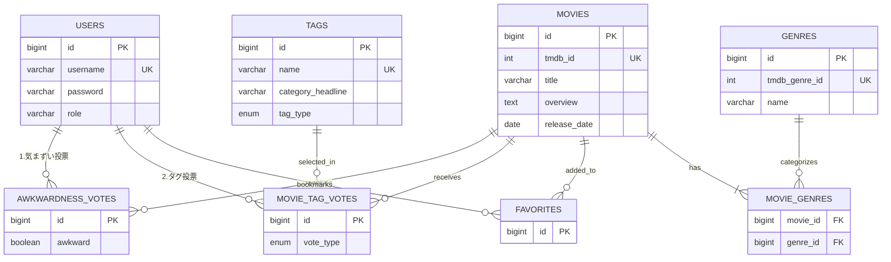

# 読後感 -Dokugokan-
**「映画選びの事故」を防ぐ、感情と文脈の共有プラットフォーム**

## 🎥 デモ動画 https://github.com/user-attachments/assets/8a0f9b69-a9ad-4992-88c2-be1fec546a30

## 🔗 サービス URL
https://dokugokan.onrender.com

## 💡 開発背景（Why）
既存の映画レビューサイトは「星の数（面白いかどうか）」が中心で、**「誰と見るべきか」「見終わった後どんな気分になるか」**という情報が不足しています。
その結果、以下のようなミスマッチが頻発していると考えました。

* デートや家族鑑賞で、気まずいシーンが流れて空気が凍る（**気まずさの事故**）
* 元気になりたい時に、評価は高いが後味が最悪な「鬱映画」を見てしまう（**読後感の事故**）

本アプリケーションは、ユーザーの主観的な「感情」と「シチュエーション」を定量化・可視化することで、これらの心理的コストを最小化するために開発しました。

## 🛠 技術スタック
* **Backend:** Java 21, Spring Boot 3 (Spring Security, Spring Data JPA)
* **Frontend:** Thymeleaf, HTML5, CSS3 (Common/Flexbox layout)
* **Database:** PostgreSQL (Neon Serverless Postgres)
* **API:** TMDB API (The Movie Database)
* **Infrastructure:** Render (Web Service), Neon (Database)

## 📊 データベース設計 (ER図)
1. **正規化と拡張性**: 投票機能において、「Yes/No判定」と「タグ選択」を別テーブルに分離し、NULL許容カラムを避ける設計にしました。
2. **整合性の担保**: `@UniqueConstraint` を用いて、DBレベルでユーザーの重複投票を防ぐ堅牢な設計にしています。
3. **外部キー管理**: 外部API(TMDB)のIDと、システム内部のIDを明確に区別して管理しています。

## 工夫した点
1.  **独自の投票ルールとデータの整合性:**
    * 単に点数をつけるだけでなく、「タグ（理由）」を選んで投票する仕組みにしました。
    * **重複投票の防止:** 一人のユーザーが同じ映画に何度も投票できないように、中間テーブル（MovieTagVote）を作成し、ユーザーIDと映画IDの組み合わせで重複を弾くように設定（ユニーク制約）しています。
2.  **APIとDBの連携（データ取得の工夫）:**
    * 世の中の全ての映画データを最初からDBに持つのは容量的に難しいため、**「ユーザーが検索・詳細表示した映画だけをAPIから取得し、DBに保存する」**という仕組みにしました。
    * 一度誰かが検索した映画はDBに保存されるため、二回目以降の表示速度が速くなるように設計しています。

## 🏗 アーキテクチャ・コードの構成
開発を進める中でコードが複雑になってきたため、保守性を意識して構成を見直しました（リファクタリング）。

* **パッケージ構成の改善（レイヤー単位から機能単位へ）:**
    * 開発当初は `Controller` `Service` といった役割ごとのフォルダ分けをしていましたが、クラスが増えるにつれて「どの機能がどこにあるか」が分かりにくくなってしまいました。
    * 現在は `movie`（映画関連）、`user`（ユーザー関連）、`voting`（投票関連）といった**「機能（ドメイン）単位」**のパッケージ構成に変更し、関連するクラスを近くに置くことで見通しを良くする作業を行っています。
* **役割の分担:**
    * Controllerに処理を書きすぎないように意識しました。Controllerは「画面からの入力を受け取るだけ」にし、具体的な処理（DBへの保存や計算など）はServiceクラスに任せるようにしています。

## 🚀 現在の課題と今後の展望
* **エラーハンドリングの改善:** 現在は想定外のエラーが発生した際にシステム標準のエラー画面が出てしまうことがあるため、ユーザーに分かりやすいメッセージを表示できるように修正したいと考えています。
* **テストの自動化:** 現在は手動で動作確認をしていますが、機能追加のたびに確認するのが大変になってきました。JUnitなどを用いた自動テストを導入し、安心してコードを変更できる環境を作りたいです。

---
*This product uses the TMDB API but is not endorsed or certified by TMDB.*# dokugokan
