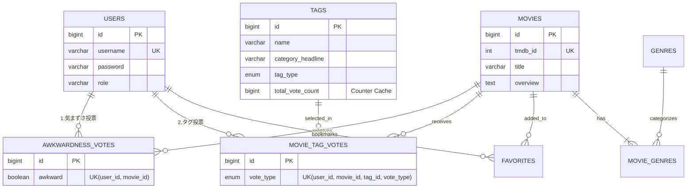

# 読後感 -Dokugokan-
**「映画選びの事故」を防ぐ、感情と文脈の共有プラットフォーム**

## 🎥 デモ動画
https://github.com/user-attachments/assets/886abfcd-31a1-4b1e-b2d4-d4619b53ddcd

## 🔗 サービス URL
https://dokugokan.onrender.com
*(※Renderの仕様により、初回アクセス時はサーバー起動のため1分ほど時間がかかる場合があります)*

---

## 💡 開発背景（Why）

### 「★5」評価の限界とミスマッチ
既存の映画レビューサイトは「作品としての面白さ（星の数）」が評価軸の中心です。しかし、実際の映画鑑賞シーンでは、以下のような**「シチュエーションによる事故」**が頻発しています。

1.  **気まずさの事故**: デートや家族鑑賞中に、予期せぬ過激なシーンが流れ空気が凍る。
2.  **読後感の事故**: 元気になりたい時に、評価は高いが後味が悪い「鬱映画」を見てしまい、気分が落ち込む。

### 解決策：感情の「見える化」
本アプリケーションは、**「誰と見るべきか（気まずさ）」**と**「見終わった後どんな気分になるか（読後感）」**を定量化・可視化します。
テキストレビューによるネタバレや誹謗中傷を排除し、「タグ」と「Yes/Noチャート」のみで直感的に判断できるプラットフォームを構築しました。

---

## 🛠 技術スタック

| Category | Tech Stack |
|:---:|:---|
| **Backend** | Java 21, Spring Boot 3.3 |
| **Database** | PostgreSQL (Neon Serverless Postgres) |
| **ORM / Data** | Spring Data JPA, Hibernate |
| **Security** | Spring Security (BCrypt Encryption) |
| **Frontend** | Thymeleaf, HTML5, CSS3, Vanilla JS |
| **API** | TMDB API (The Movie Database), Spring WebClient (Reactive) |
| **Testing** | JUnit 5, Mockito, Spring Boot Test |
| **Infra** | Render (Web Service) |

---

## 🔧 こだわった技術的実装（Engineering Highlights）

### 1. パフォーマンス：Read-Heavyな特性を考慮した設計
Webサービスの特性上、圧倒的に多い「読み込み（参照）」を高速化するため、**書き込み時にコストを払う設計**を採用しました。

* **カウンターキャッシュ (Counter Cache)**:
    * タグの集計を毎回 `COUNT(*)` するのではなく、投票時（Write）に `Tag` エンティティの `totalVoteCount` を増加・減少させて保存。
    * これにより、トップページや検索結果などのアクセス頻度が高いページで、高速なレスポンスを実現しました。
* **非同期バッチ処理 (Async Batch Processing)**:
    * 「トレンド集計（過去1週間の人気映画）」のような重い処理は、ユーザーアクセス時ではなく、`@Scheduled` を用いたバッチ処理としてバックグラウンドで実行。
    * 集計結果を `TrendingMovie` テーブルに保存しておくことで、トップページの表示負荷を最小限に抑えています。

### 2. 外部API連携
全世界の映画データを保持するのはリソース的に不可能なため、**「オンデマンド・キャッシング」**戦略を取りました。

1.  ユーザーが検索を実行 → DBに存在しなければ **TMDB API (WebClient)** から非同期で取得。
2.  取得したデータを正規化して自社DB（Movies, Genresテーブル）に保存。
3.  2回目以降のアクセスや、詳細ページでの表示は全て自社DBから高速に提供。

この際、`TransactionTemplate` と `Schedulers.boundedElastic()` を適切に組み合わせ、非同期処理とDBトランザクションの整合性を担保しています。

### 3. 保守性：ドメイン駆動を意識したパッケージ構成
開発初期は `Controller/Service` というレイヤー分けでしたが、クラス増加に伴い可読性が低下しました。
リファクタリングを行い、**「機能（ドメイン）単位」**の構成に変更しました。

* `com.example.demo.movie` (映画検索・詳細)
* `com.example.demo.voting` (投票ロジック・集計)
* `com.example.demo.user` (認証・会員管理)

これにより、機能修正時の影響範囲が明確になり、保守性が向上しました。

---

## 📊 データベース設計 (ER図)

データの整合性（Data Integrity）を最優先し、アプリケーション層だけでなくDB層でも `@UniqueConstraint`（複合ユニーク制約）を設定して重複投票を物理的に防止しています。

🚀 今後の展望 (Future Roadmap)
### 1. テスト拡充による品質担保
現在はコア機能（投票・集計ロジック）の実装を最優先に進めてきました。
開発を進める中で、「機能追加時に既存機能が壊れていないか」を確認する手動テストのコストが高くなってきたため、今後は**回帰テスト（Regression Testing）の自動化**に挑戦したいと考えています。

* **単体テストの拡大**: 複雑な条件分岐を持つ「投票サービスのロジック」を中心に、JUnitでの検証範囲を広げる。
* **自動化**: 手動で行っているブラウザ確認作業を、将来的にはプログラムで自動化し、開発サイクルを効率化する手法を学びたいと考えています。

2. フロントエンドの再設計と標準化（保守性の向上）
機能追加に伴いCSS/HTML構造が複雑化してきたため、長期的な運用に耐えうる設計へ刷新を計画しています。

共通化への移行: ThymeleafのFragment機能を活用し、UIパーツ（カード、ボタン等）を共通化。

CSS設計のルール化: クラス名の衝突を防ぎメンテナンス性を高めるため、BEMやFLOCSSといった命名規則を導入し、予測可能なスタイル設計を目指します。

3. ユーザー体験（UX）の継続的な改善
エラーハンドリングを強化し、ユーザーに対してシステムエラーではなく具体的な解決策（入力不備の指摘など）を提示するよう改修を進めます。

---
This product uses the TMDB API but is not endorsed or certified by TMDB.
